# FlowForge

FlowForge is an enterprise-grade, event-driven project and task management platform built on a microservices architecture. It enables teams to collaborate efficiently through unified workspaces, manage day-to-day operations via interactive Kanban boards, and gain actionable productivity insights through real-time analytics dashboards.

[](https://github.com/Noel-Mathews-Org/FlowForge/actions/workflows/ci-gateway.yml)
[](https://github.com/Noel-Mathews-Org/FlowForge/actions/workflows/ci-auth-service.yml)
[](https://github.com/Noel-Mathews-Org/FlowForge/actions/workflows/ci-project-service.yml)
[](https://github.com/Noel-Mathews-Org/FlowForge/actions/workflows/ci-task-service.yml)
[](https://github.com/Noel-Mathews-Org/FlowForge/actions/workflows/ci-analysis-service.yml)
[](https://github.com/Noel-Mathews-Org/FlowForge/actions/workflows/ci-frontend.yml)

## Quick Navigation
- [Section 1 — FlowForge](#section-1--flowforge)
- [Verification (Important)](#verification-important)
- [Section 2 — Architecture Overview](#section-2--architecture-overview)
- [Section 3 — DevOps Architecture](#section-3--devops-architecture)
- [Section 4 — Project Setup](#section-4--project-setup)
- [Section 5 — CI/CD Pipeline (Deep Dive)](#section-5--cicd-pipeline-deep-dive)
- [Section 6 — Branching Strategy](#section-6--branching-strategy)
- [Section 7 — Deployment Strategies](#section-7--deployment-strategies)
- [Section 8 — Secret Management](#section-8--secret-management)
- [Section 9 — Networking and Routing](#section-9--networking-and-routing)
- [Section 10 — Observability](#section-10--observability)
- [Section 11 — Security (Shift-Left)](#section-11--security-shift-left)
- [Section 12 — Connection Verification](#section-12--connection-verification)
- [Section 13 — Code Quality](#section-13--code-quality)
- [Section 14 — Storage](#section-14--storage)
- [Section 15 — Service Reference](#section-15--service-reference)

---

## Verification (Important)

This is an important step to ensure our services are correctly deployed and running across different namespaces.

### Dev Environment
Verification of our services running in the `dev` namespace (`kubectl get all -n dev`):

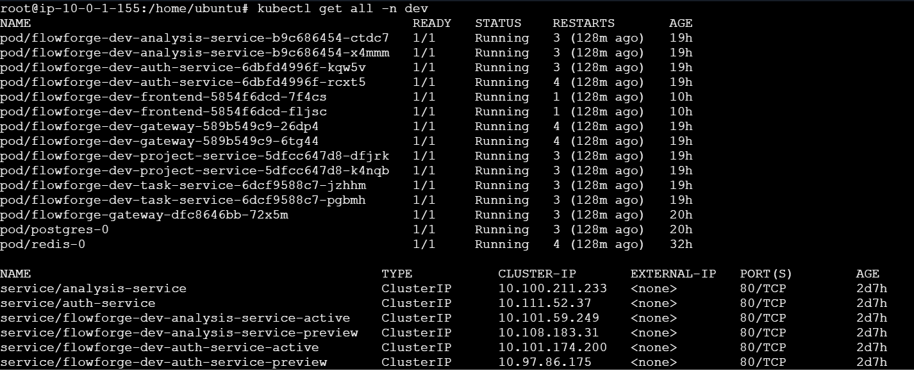
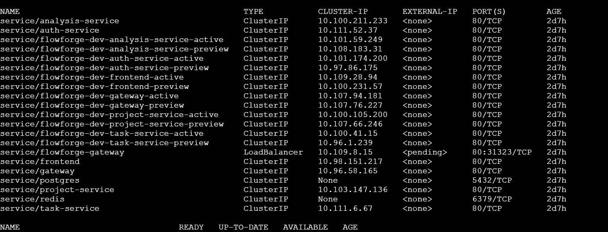
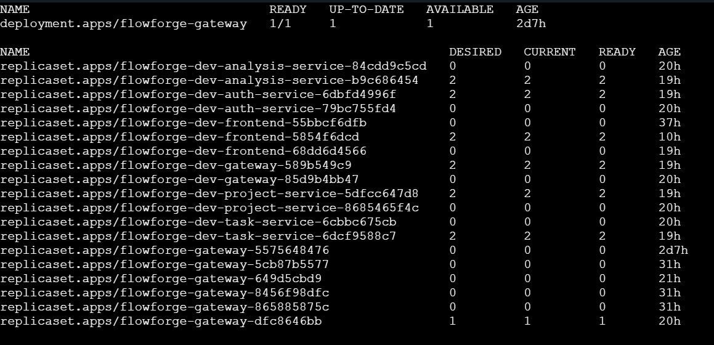
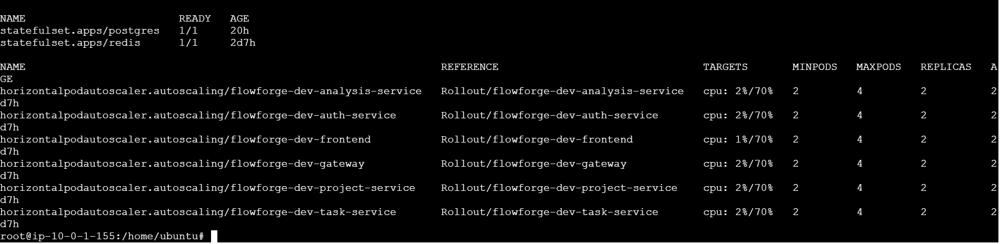

### Prod Environment
Verification of our services running in the `prod` namespace (`kubectl get all -n prod`):

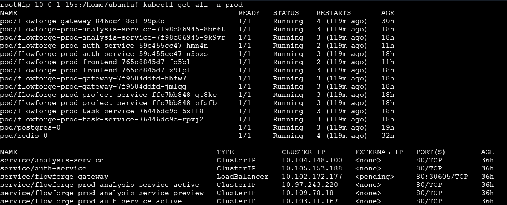
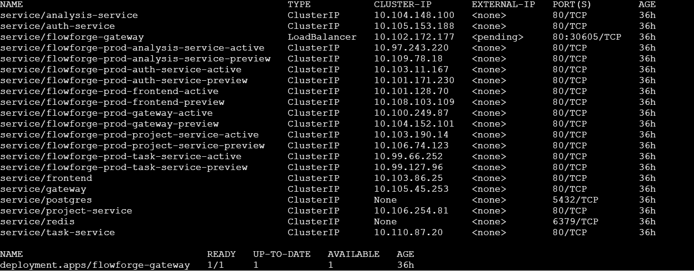
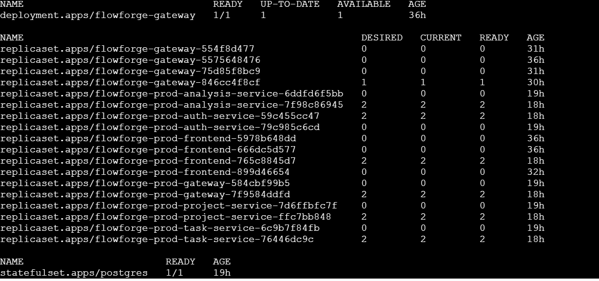
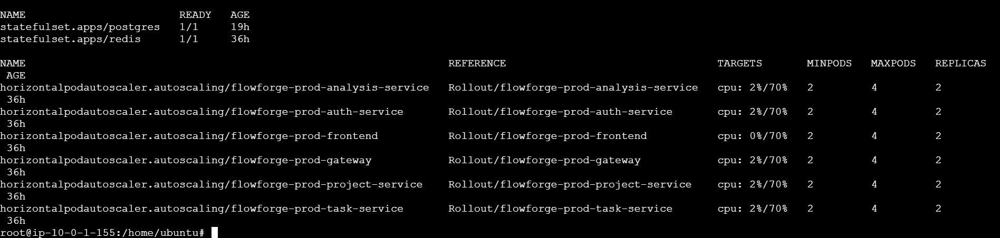

---

## Section 2 — Architecture Overview

FlowForge leverages an asynchronous, event-driven microservices architecture. Each backend service operates independently, exposing a REST API and communicating state changes via Redis Streams.

| Service | Language/Framework | Port | Database | Responsibilities |
|:---|:---|:---|:---|:---|
| API Gateway | Python / FastAPI | 8000 | None (Stateless) | Auth forwarding, JWT validation, rate limiting, routing logic |
| Auth Service | Python / FastAPI | 8001 | `auth_db` | User identity, authentication, JWT issuance, organization invites |
| Project Service | Python / FastAPI | 8002 | `project_db` | Workspaces, memberships, approval proxying |
| Task Service | Python / FastAPI | 8003 | `task_db` | Kanban board, task CRUD, event emission |
| Analysis Service | Python / FastAPI | 8004 | `analytics_db` | Audit logging, real-time analytics aggregation |
| Frontend | TypeScript / Next.js | 3000 | None | UI components, client-side routing, React Query data fetching |

**API Gateway Role**
The API Gateway serves as the single entry point. It validates all incoming requests using a shared HS256 JWT Secret (`jwt_secret`) to decode and verify token claims before proxying traffic downstream. It also enforces API rate limits by leveraging Redis as an in-memory datastore. 

**Redis Usage Pattern**
Redis serves a dual purpose in this architecture:
1. **Event Bus (Streams):** Acts as an asynchronous message broker via Redis Streams (e.g., `audit_log` stream) for decoupled inter-service communication.
2. **Caching/Rate Limiting:** Functions as a fast, ephemeral key-value store to throttle incoming API requests at the Gateway level.

**PostgreSQL Schema Ownership**
The system uses a single PostgreSQL instance logically partitioned into four distinct databases, with strict schema ownership boundaries:
- `auth_db`: Owned by Auth Service (`users`, `refresh_tokens`, `invite_tokens`).
- `project_db`: Owned by Project Service (`projects`, `project_members`, `approval_requests`).
- `task_db`: Owned by Task Service (`tasks`, `task_comments`).
- `analytics_db`: Owned by Analysis Service (`audit_events`, `daily_task_stats`, `user_activity_stats`).

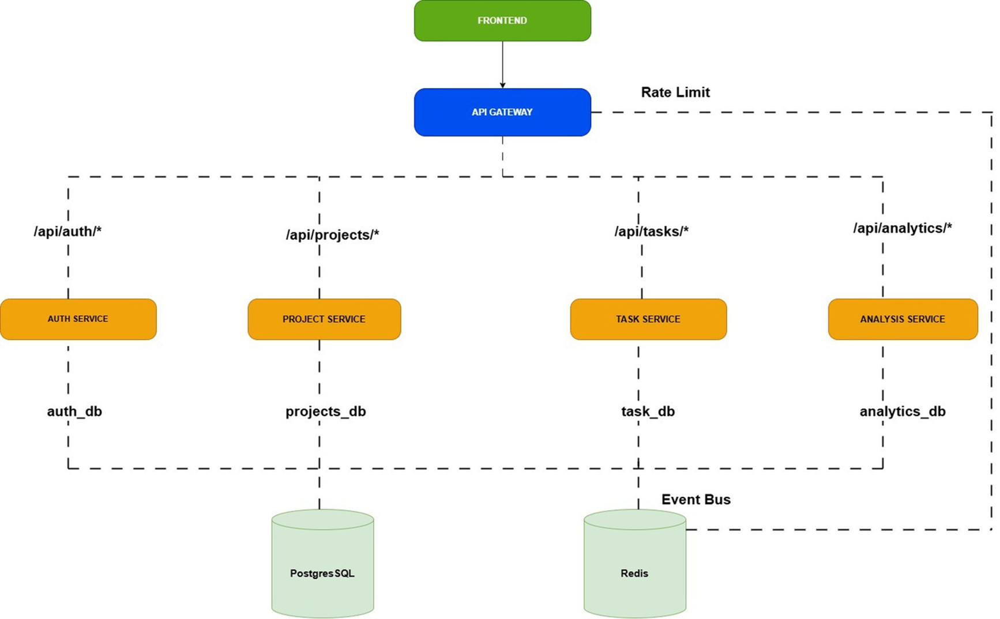

### Service Reference

#### API Gateway
- **Purpose:** Single entry point handling TLS termination, JWT verification, and rate limiting.
- **Tech Stack:** Python 3.12, FastAPI.
- **Endpoints:**
  - `GET /health`
- **Environment Variables:** `JWT_SECRET`, `REDIS_URL`, `*_SERVICE_URL`, `RATE_LIMIT_REQUESTS`, `GATEWAY_PORT`, `ALLOWED_ORIGINS`
- **Helm Chart:** `./charts/gateway`

#### Auth Service
- **Purpose:** Manages user identities, authentication, and platform invitations.
- **Tech Stack:** Python 3.10, FastAPI, SQLAlchemy, PyJWT, passlib.
- **Endpoints:**
  - `GET /health`
  - `POST /login`, `POST /register`, `POST /invite`, `POST /invite-to-project`
  - `GET /me`, `PUT /me`, `GET /lookup`, `GET /user-by-email`
  - `GET /users`, `POST /users`, `PATCH /users/{id}`, `DELETE /users/{id}`
- **Environment Variables:** `DATABASE_URL`, `REDIS_URL`, `JWT_SECRET`, `SMTP_*`
- **Helm Chart:** `./charts/auth-service`

#### Project Service
- **Purpose:** Manages workspaces, project memberships, and proxies task approval requests.
- **Tech Stack:** Python 3.10, FastAPI, SQLAlchemy.
- **Endpoints:**
  - `GET /health`
  - `GET /`, `POST /`, `GET /{id}`, `PATCH /{id}`
  - `GET /{id}/members`, `POST /{id}/members`, `DELETE /{id}/members/{user_id}`
  - `GET /approvals`, `POST /approvals/{id}/approve`, `POST /approvals/{id}/reject`, `POST /request-access`
- **Environment Variables:** `DATABASE_URL`, `REDIS_URL`, `TASK_SERVICE_URL`, `SMTP_*`
- **Helm Chart:** `./charts/project-service`

#### Task Service
- **Purpose:** Core Kanban operations, task CRUD, comments, and broadcasting events to Redis.
- **Tech Stack:** Python 3.10, FastAPI, SQLAlchemy.
- **Endpoints:**
  - `GET /health`
  - `POST /`, `PUT /{id}`, `GET /{id}`, `DELETE /{id}`
  - `GET /project/{id}`
  - `GET /project/{id}/pending`, `POST /{id}/approve`, `POST /{id}/reject`
  - `POST /{id}/comments`, `GET /{id}/comments`
- **Environment Variables:** `DATABASE_URL`, `REDIS_URL`
- **Helm Chart:** `./charts/task-service`

#### Analysis Service
- **Purpose:** Subscribes to Redis streams to collect audit logs and aggregate system metrics.
- **Tech Stack:** Python 3.10, FastAPI, SQLAlchemy, Redis Streams.
- **Endpoints:**
  - `GET /health`
  - `GET /overview`, `GET /task-throughput`, `GET /user-activity`
  - `GET /events`, `GET /audit-log`, `GET /project/{id}/stats`
- **Environment Variables:** `DATABASE_URL`, `REDIS_URL`, `STREAM_CONSUMER_GROUP`, `STREAM_CONSUMER_NAME`
- **Helm Chart:** `./charts/analysis-service`

#### Frontend
- **Purpose:** Client-facing web application rendering the dashboard and Kanban interface.
- **Tech Stack:** Next.js 14, React 18, TailwindCSS, React Query.
- **Endpoints:** Handled strictly client-side/SSR via Next.js.
- **Environment Variables:** `NEXT_PUBLIC_API_URL`
- **Helm Chart:** `./charts/frontend`

> 📖 Full reference: [Architecture Overview](docs/architecture.md)

---

## Section 3 — DevOps Architecture

FlowForge's infrastructure is built on a cloud-native GitOps foundation, ensuring that all infrastructure and application states are declarative and version-controlled.

- **Kubernetes (k8s):** The core container orchestration platform hosting all stateless services, Gateway APIs, and stateful databases.
- **Helm:** Used to template and bundle Kubernetes manifests into reusable, configurable charts.
- **Argo CD:** The GitOps controller running inside the cluster. It constantly monitors the repository's `Helm` directory and automatically synchronizes the cluster state to match the code.
- **Argo Rollouts:** Provides advanced deployment capabilities (Canary and Blue-Green) beyond standard Kubernetes Deployments, ensuring zero-downtime updates and safe rollbacks.
- **GitHub Actions:** The CI/CD engine orchestrating linting, testing, security scanning, container builds, and updating image tags in the Helm configurations.
- **SonarQube:** Performs Static Application Security Testing (SAST) and code quality checks during the CI pipeline.
- **Prometheus & Grafana:** Prometheus scrapes and aggregates real-time cluster metrics, while Grafana provides visual dashboards for observability.
- **Loki:** Aggregates logs across all pods, allowing for centralized log querying.
- **Alertmanager:** Processes alerts triggered by Prometheus rules and dispatches notifications based on configured thresholds.
- **Keycloak:** Configured as an OIDC provider to securely manage external access to cluster tooling (e.g. `kubectl oidc-login`).
- **Sealed Secrets:** Asymmetric cryptography engine by Bitnami that encrypts sensitive configuration files before they are pushed to the Git repository.
- **Kyverno:** A policy engine enforcing Kubernetes-native security rules, such as disallowing the use of mutable `latest` image tags.

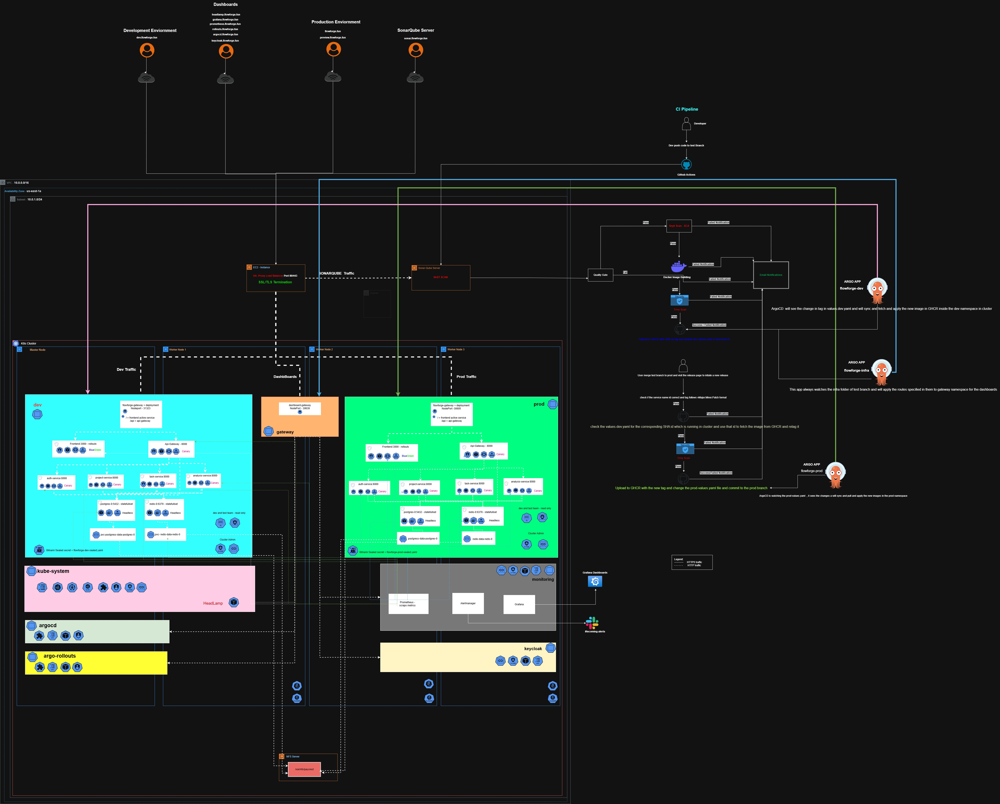

**GitOps Model**
1. A developer pushes code or merges a PR to the `test` or `prod` branch.
2. GitHub Actions builds the Docker image and pushes it to GHCR with the commit SHA as the tag.
3. The workflow patches the respective `values-dev.yaml` or `values-prod.yaml` with the new image tag and commits it back to the repository.
4. Argo CD detects the commit and applies the changes to the cluster, initiating an Argo Rollout.

**Environment Isolation**
The cluster supports two completely isolated environments: `dev` and `prod`. Isolation is enforced at the network level using `NetworkPolicies` that prevent cross-namespace communication, and at the routing level via separate Gateway API `HTTPRoute` definitions (`flowforge-routes` vs `flowforge-preview-routes`).

> 📖 Full reference: [DevOps Architecture](docs/devops_architecture.md)

---

## Section 4 — Project Setup

### 4a — Prerequisites
Ensure the following tools are installed locally:
- `kubectl`
- `helm` (v3+)
- `argocd` CLI
- `docker` & `docker-compose`
- `node` (v18+)
- `python` (3.10 / 3.12)
- `kubeseal` (Bitnami Sealed Secrets CLI)
- `git`

### 4b — Local Development with Docker Compose
The `docker-compose.yml` spins up a complete local instance.
```bash
docker-compose up --build
```
**Exposed Services:**
- Gateway: `:8000` (Proxies to downstream services)
- Frontend: `:3000`
- PostgreSQL: Internal to docker network (initialized via `initdb.sql`)
- Redis: Internal to docker network

All backend services are configured to depend on `postgres` and `redis` passing their respective `healthcheck` commands before starting.

### 4d — Helm Chart Structure
The project uses a Helm Umbrella Chart located in the `Helm/` directory.
- `Chart.yaml`: Defines the umbrella chart and its sub-chart dependencies (`gateway`, `frontend`, etc.).
- `charts/`: Contains individual charts for each service.
- `values-dev.yaml` & `values-prod.yaml`: Environment-specific overrides (e.g., domain names, image tags, replicas).
- `templates/`: Contains shared global templates:
  - `gateway.yaml`: Defines the `kgateway` Gateway API listener.
  - `http-routes.yaml`: Maps HTTP paths to services.
  - `network-policies.yaml`: Enforces namespace and tier-level isolation.
  - `postgres.yaml` & `redis.yaml`: StatefulSets for core databases.

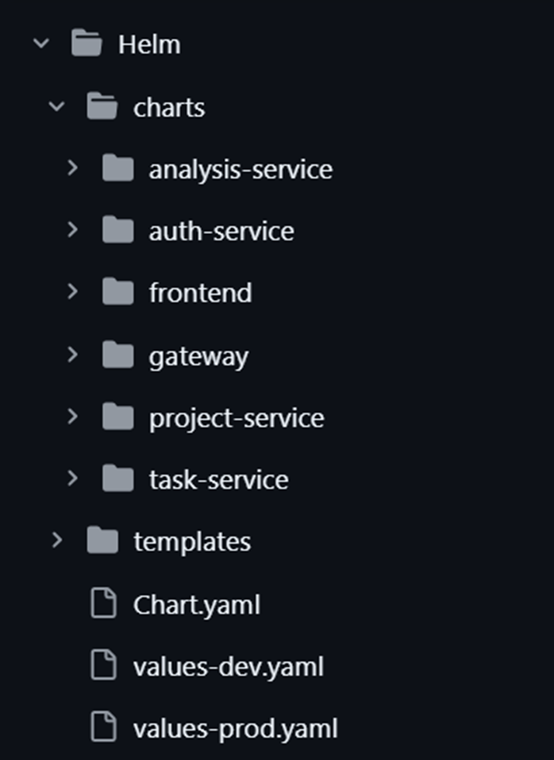

---

## Section 5 — CI/CD Pipeline (Deep Dive)

### 5a — Pipeline Philosophy
FlowForge uses a "shift-left security" model. Security checks (SAST, Dependency Scanning) run *before* the Docker image is built. If a quality gate fails, the pipeline aborts, preventing vulnerable code from ever reaching the container registry. 

### 5b — Shift Left Security

#### Static Analysis (SAST) — SonarQube
SonarQube scanning runs natively in the CI pipeline *before* the Docker build step. The `sonarsource/sonarqube-quality-gate-action@v1` step halts the pipeline if critical code smells, bugs, or vulnerabilities are detected.

#### Kyverno Cluster Policies
The cluster utilizes a `disallow-latest-tag` Kyverno policy in `Enforce` mode. This guarantees immutability by outright blocking the scheduling of any Pod attempting to use a `:latest` container tag.

#### Snyk & Trivy Scanning
- **Snyk:** Used for Software Composition Analysis (SCA) to check code dependencies for known vulnerabilities.
- **Trivy:** Used for container image scanning before pushing to GHCR.

#### Dynamic Analysis (DAST) — OWASP ZAP
DAST scanning via OWASP ZAP is performed manually.

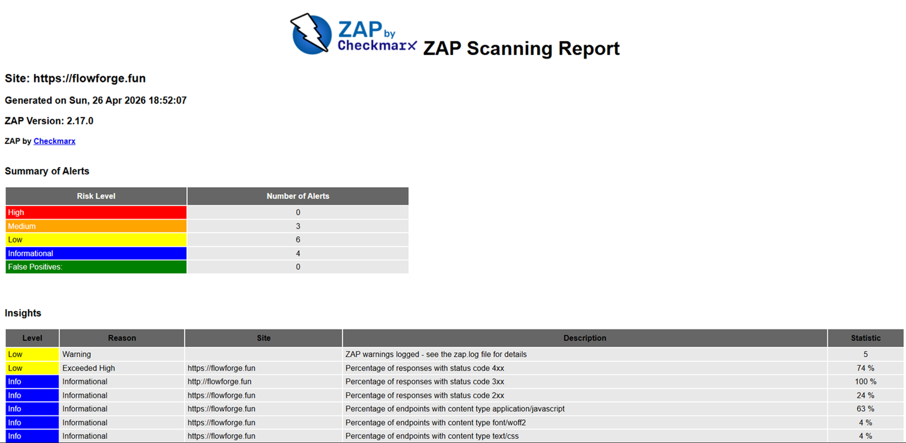

### 5b — Reusable Workflow (`_ci-reusable.yml`)
The reusable CI workflow centralizes the build and deploy logic for all services.
- **Inputs:** `service_name`, `project_key`.
- **Jobs:**
  - `build-and-deploy`:
    1. Checks out the code.
    2. Runs SonarQube Scanner and waits for the Quality Gate.
    3. Runs Snyk dependency scanning (`npm` for frontend, `pip` for Python backends).
    4. Builds the Docker image.
    5. Runs Trivy vulnerability scanner on the built image.
    6. Pushes to GHCR.
    7. Updates `Helm/values-dev.yaml` with the new commit SHA and pushes the commit.
  - `notify`: Sends an HTML email summary of the pipeline result.
- **Secrets Expected:** `SONAR_TOKEN`, `SONAR_HOST_URL`, `SNYK_TOKEN`, `MAIL_USERNAME`, `MAIL_PASSWORD`, `DEVELOPMENT_TEAM_EMAIL`, `GH_PAT`.

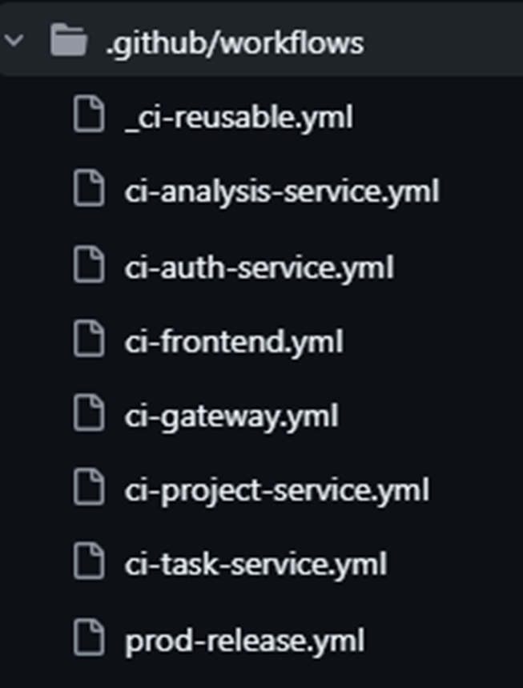

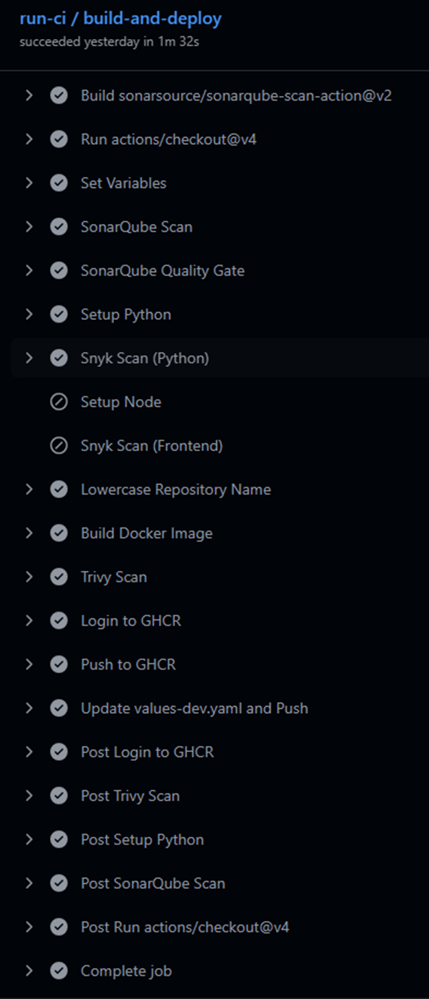

### 5c — Per-Service Workflows
- `ci-auth-service.yml`, `ci-analysis-service.yml`, `ci-frontend.yml`, `ci-gateway.yml`, `ci-project-service.yml`, `ci-task-service.yml`
- **Trigger:** Pushes to the `test` branch modifying paths within their respective service directories.
- **Action:** They act as callers to the `.github/workflows/_ci-reusable.yml` workflow, passing the specific `service_name`, `project_key`, and injecting secrets.

### 5d — Production Release (`prod-release.yml`)
- **Trigger:** Triggers when a GitHub Release is `published`.
- **Flow:**
  1. Parses the release tag (e.g., `auth-service-v1.2.0`).
  2. Fetches the image SHA currently deployed in `dev` from `values-dev.yaml` (ensuring we only promote code that has survived dev).
  3. Pulls the image from GHCR, runs a final Trivy scan, and retags it with SemVer (`v1.2.0`).
  4. Pushes the SemVer-tagged image to GHCR.
  5. Updates `Helm/values-prod.yaml` and commits it to the `prod` branch, triggering Argo CD to sync production.

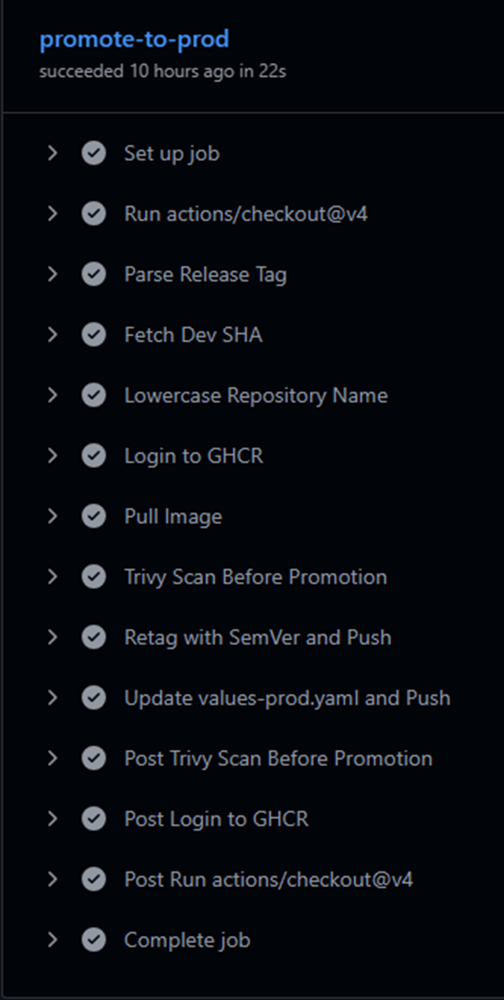

### 5f — GitHub Actions Secrets Reference

| Secret Name | Used In | Purpose | Where to Set It |
|:---|:---|:---|:---|
| `SONAR_TOKEN_*` | `_ci-reusable.yml`, Per-Service | Authenticate SonarQube scanning per project | Repo Secrets |
| `SONAR_HOST_URL` | `_ci-reusable.yml` | URL of the SonarQube server | Repo/Org Secrets |
| `SNYK_TOKEN` | `_ci-reusable.yml` | Authenticate Snyk SCA scans | Repo/Org Secrets |
| `MAIL_USERNAME` | `_ci-reusable.yml`, `prod-release.yml` | SMTP username for pipeline notifications | Repo Secrets |
| `MAIL_PASSWORD` | `_ci-reusable.yml`, `prod-release.yml` | SMTP password for pipeline notifications | Repo Secrets |
| `DEVELOPMENT_TEAM_EMAIL` | `_ci-reusable.yml`, `prod-release.yml` | Target email for pipeline summaries | Repo Secrets |
| `GH_PAT` | `_ci-reusable.yml`, `prod-release.yml` | Personal Access Token to commit back to Git | Repo Secrets |
| `GITHUB_TOKEN` | `_ci-reusable.yml`, `prod-release.yml` | Default built-in token to push to GHCR | Automatically provided |


---

### Pipeline Flow

When developers push code changes to the `test` branch, the CI pipeline for the corresponding service is activated via path-based triggers, executing our reusable workflow.


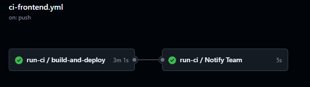

Upon successful completion, the CI pipeline builds a new Docker image, uploads it to the GitHub Container Registry (GHCR) using the commit SHA as the tag, and updates the `values-dev.yaml` file.

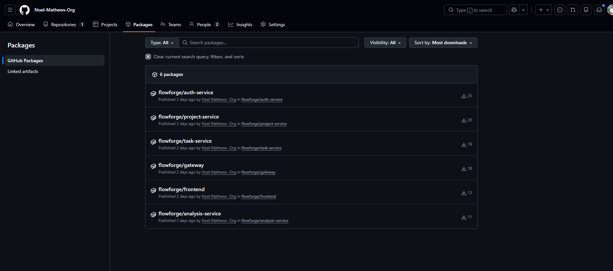

The commit SHA tag uniquely identifies the origin of the image, helping us maintain strict deployment governance and traceability.


Argo CD detects this change in `values-dev.yaml` for the `flowforge-dev` application. The rollout status is initially marked as `suspended` because auto-promotion is disabled in our Argo Rollouts configuration.


From here, we use the Argo Rollouts dashboard to manually promote the application.


After promoting:


Once promoted, Argo CD synchronizes the application, pulling and applying the new image.


After synchronization, the new frontend becomes active.

Here is the old frontend for dev (`dev.flowforge.fun`):


And here is the new frontend for `dev.flowforge.fun`:


To deploy to production, we first create a Pull Request (PR) against the `prod` branch. This PR is required due to our strict branch protection rules.


Once accepted, the new code is merged into the `prod` branch. Next, we draft a new GitHub Release. We use releases as a manual deployment gate for production to ensure no accidental automated deployments occur.


We select "Draft a new release" because the production deployment triggers on a published release. The release tag must strictly follow case-sensitive naming conventions matching the exact service name matrix. If the naming is incorrect, the pipeline will fail. A release engineer typically manages this to ensure accuracy.


Publishing the release automatically triggers the production release pipeline.


Once the pipeline completes successfully, it updates `values-prod.yaml`. Argo CD detects this change for the `flowforge-prod` app and suspends the rollout since auto-promotion is disabled.


We then navigate to the Argo Rollouts dashboard:


Before promoting the production rollout, we can verify the changes via a preview URL (`preview.flowforge.fun`). This allows QA and stakeholders to test the entire suite safely before live traffic is routed to the new version.


Once verification is complete, we promote the rollout. After promoting everything:


We can then observe the status change in Argo CD.


After the release, the final production UI is live.


---

## Section 6 — Branching Strategy

The repository follows a strict branch-to-environment mapping:

- **`test` branch:** The default development integration branch. Merges here trigger the standard CI workflows and deploy directly to the `dev` namespace in Kubernetes.
- **`prod` branch:** The production configuration branch. Contains the live `values-prod.yaml`. Only the `prod-release.yml` workflow commits to this branch.
- **Feature Branches (`feature/*`):** Created by developers. Must be reviewed and merged via PR into `test`.
- **Releases:** Creating a GitHub Release automatically promotes an existing `dev` image to `prod`.

**Branching Flow:**
```text
[feature/add-login] ----> PR ----> [test] (Triggers CI -> Deploys to Dev)
                                     |
                               (GitHub Release)
                                     |
                                     v
                                   [prod] (Triggers Prod CI -> Deploys to Prod)
```

> 📖 Full reference: [Branching Strategy](docs/runbook/04-branching-strategy.md)

---

## Section 7 — Deployment Strategies

FlowForge entirely circumvents standard Kubernetes `Deployment` resources in favor of **Argo Rollouts**, which provide intelligent traffic shaping during deployments.

- **Backend Services:** Utilize a **Canary** rollout strategy. When a new version is synced, Argo Rollouts initially routes 50% (because we only have 2 replicas) to the new pods. It can pause indefinitely or analyze metrics before automatically promoting the rollout to 100%.
- **Frontend Service:** Utilizes a **Blue-Green** deployment. A parallel stack is spun up and the `active` HTTPRoute is seamlessly swapped over only once the green stack is confirmed healthy.

**Horizontal Pod Autoscaler (HPA)**
Autoscaling is configured for services based on CPU and memory thresholds defined in `hpa.yaml` files inside each service's Helm chart, dynamically adjusting replicas between a set minimum and maximum.

> 📖 Full reference: [Deployment Strategies](docs/runbook/05-deployment-strategies.md)

---

## Section 8 — Secret Management

*Note: This is an important topic to ensure our cluster and application remain secure.*

### 8a — The Golden Rules (non-negotiable)
1. **NO secret, password, token, or credential may ever exist in any file committed to the repository.**
2. **`.env` files are always in `.gitignore` and must never be committed.** We explicitly untrack `.env` files from GitHub to ensure no accidental leaks occur.
3. All secrets in-cluster are managed exclusively via **Bitnami Sealed Secrets**.
4. All secrets in CI/CD are stored exclusively in **GitHub Actions Secrets**.
5. If a secret is accidentally committed, treat it as compromised immediately — rotate it before removing it from git history.

### 8b — Bitnami Sealed Secrets (in-cluster)
Sealed Secrets allows us to securely store encrypted configuration in Git. The `kubeseal` CLI encrypts the raw YAML using the controller's public key. Once pushed to the cluster, only the Sealed Secrets controller has the private key to decrypt it into a standard `Secret`. This is critical for adopting a true GitOps model without compromising security.

**Creating a Secret:**
```bash
kubeseal --format yaml --scope strict < my-raw-secret.yaml > flowforge-dev-sealed.yaml
```
- **Scope (`strict`):** Ensures the secret can only be decrypted in the specific namespace and with the exact name it was sealed for.
- **Files:** `Helm/templates/flowforge-dev-sealed.yaml` and `Helm/templates/flowforge-prod-sealed.yaml`.

**Rotation & Disaster Recovery:**
To rotate, delete the existing `SealedSecret`, generate a new one via `kubeseal`, and commit. If the cluster's private key is lost, all Sealed Secrets must be recreated from scratch, as they cannot be decrypted.

### 8c — GitHub Actions Secrets (CI/CD)
CI/CD secrets are injected at runtime by GitHub Actions into environment variables. They are never printed to logs (GitHub masks them as `***`). New secrets must be added via `Settings -> Secrets and variables -> Actions`.

### 8d — Environment Variable Discipline
All backend services use Pydantic `BaseSettings` (e.g., `config.py`) or standard `os.getenv` to load configuration. 
In Kubernetes, these are mounted directly from the decrypted `Secret` utilizing `envFrom` or specific `valueFrom` blocks in the pod definition. No `.env` files are used in production.

We also dynamically recreate the DB URL at runtime. By avoiding monolithic secrets (like storing the entire connection string) and instead assembling it from granular parts (e.g., `DB_HOST`, `DB_USER`, `DB_PASSWORD`), we improve security and make rotation simpler.

### 8e — What Is and Is Not Tracked by Git
**TRACKED (Safe to commit):** 
- `*sealed.yaml` files
- `values.yaml` files (with no plaintext secrets)
- `Dockerfile`, workflow YAML files
- Code files (e.g., `config.py`)

**NOT TRACKED (Must never be committed):**
- `.env`, `.env.*`
- Raw Kubernetes `Secret` YAML
- Kubeconfig credentials

> 📖 Full reference: [Secret Management](docs/runbook/06-secret-management.md)

---

## Section 9 — Networking and Routing

FlowForge uses the modern Kubernetes Gateway API (`kgateway`) replacing traditional Ingress controllers.

- **Gateway API:** Configured via `Helm/templates/gateway.yaml` exposing listeners for HTTP (port 80) across specific domains.
- **HTTPRoutes:** Configured in `http-routes.yaml`. 
  - Path `/api` routes directly to the `gateway` pod.
  - Path `/` routes to the `frontend-active` service.
- **Network Policies:** 
  - `default-deny-all`: A catch-all Zero-Trust policy that blocks all ingress and egress traffic by default for any pod in the namespace. This prevents lateral movement from rogue or unlabelled pods.
  - `allow-kgateway-to-gateway`: Explicitly opens traffic from the external Gateway edge.
  - `allow-gateway-to-backend`: Explicitly allows the internal gateway to reach the application tier.
  - `allow-backend-to-data`: Restricts database access strictly to backend pods. Postgres and Redis cannot be reached externally.
- **External Observability Routes:** Dedicated routes are configured in `infra/infrastructure/*-route.yaml` for administrative access to Grafana, Prometheus, Loki, Headlamp, and ArgoCD.

> 📖 Full reference: [Networking](docs/runbook/08-networking.md)

---

## Section 10 — Observability

The observability stack relies on the `kube-prometheus-stack` supplemented by Loki for log aggregation.

- **Metrics & Logging:** Prometheus automatically scrapes `/metrics` endpoints across pods. Loki collects stdout/stderr logs from all containers. 
- **Analysis Service:** Reads from the Redis `audit_log` stream, aggregating internal event metrics (`tasks_completed`, `user_activity`), exposing them via internal API endpoints.
- **Alertmanager Rules (`monitoring-rules.yaml`):**
  - `ServiceDown`: Triggers if any service endpoint is unreachable for 2 minutes.
  - `PodCrashLooping`: Triggers if a pod restarts frequently (rate > 5 in 15m).
  - `NodeDown`: Triggers if a Kubernetes worker node reports `NotReady`.

Additionally, we use Loki for centralized log aggregation. We have configured Alertmanager to send real-time notifications to Slack and Gmail to ensure timely incident response.

> 📖 Full reference: [Observability](docs/runbook/10-observability.md)

---

## Section 11 — Security (Shift-Left)

### 11d — RBAC Inside Services
Role-Based Access Control is hardcoded in the database (`user_role` enum) and enforced via FastAPI route dependencies:
- **Admin:** Full system privileges.
- **Manager:** Can create projects, invite members, and approve task promotions.
- **Member:** Can view projects, create tasks, and propose statuses.

### 11e — JWT and Session Management
The Gateway API validates sessions at the edge. The Auth service issues an HS256 JWT containing `exp`, `sub`, `email`, `role`, and `org` claims. Refresh tokens are tracked in the `refresh_tokens` table in `auth_db`, allowing targeted session revocation.

---

## Section 12 — Connection Verification

### 12a — Verifying Dev Without Touching Prod
Authenticate your CLI context to the cluster using OIDC (via Keycloak):
```bash
kubectl oidc-login get-token --oidc-issuer-url=...
kubectl config use-context flowforge
```
Verify the Dev namespace:
```bash
kubectl get pods -n dev
kubectl logs -f deployment/gateway -n dev
argocd app get flowforge-dev
```

### 12b — Verifying Prod Without Touching Dev
Ensure strict namespace targeting:
```bash
kubectl get rollouts -n prod
kubectl get hpa -n prod
kubectl get sealedsecrets -n prod
```

### 12c — Database Connectivity Checks
To safely test database connectivity from inside the cluster without exposing ports externally:
```bash
kubectl exec -it -n dev <auth-service-pod-name> -- python -c "import socket; print(socket.create_connection(('postgres.dev.svc.cluster.local', 5432)))"
```

### 12d — End-to-End Smoke Test
Use the exposed Gateway routing URL to test the flow:
```bash
# 1. Login
curl -X POST https://dev.flowforge.fun/api/auth/login -d '{"email":"user@stratum.com", "password":"password"}'

# 2. Access Protected Resource
curl -H "Authorization: Bearer <JWT>" https://dev.flowforge.fun/api/projects/
```

> 📖 Full reference: [Connection Verification](docs/runbook/12-connection-verification.md)

---

## Section 13 — Code Quality

Code quality is enforced via `sonar-project.properties` defined in each service's root directory. Developers are encouraged to run local Sonar scanners before pushing to avoid CI pipeline failures at the Quality Gate stage.

     

> 📖 Full reference: [Code Quality](docs/runbook/11-code-quality.md)

---

## Section 14 — Storage

Stateful storage is managed by dynamically provisioned PersistentVolumes.
- **Postgres:** Mounted via the `postgres_data` PersistentVolumeClaim. Handled by a StatefulSet ensuring data persists across pod restarts.
- **Redis:** Configured with Append-Only File (`AOF`) persistence mounted to `redis_data`, securing event streams and rate-limiting keys against abrupt crashes.


> 📖 Full reference: [Storage](docs/runbook/09-storage.md)
