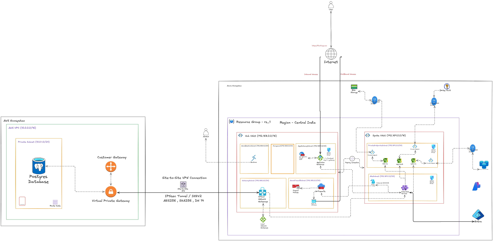

# Hybrid Cloud App Deployment Architecture

This directory contains the architecture design for FlowForge's highly secure, enterprise-grade hybrid cloud application deployment, leveraging both **AWS** and **Azure** ecosystems.

## Architecture Overview

The application utilizes a Hub-and-Spoke topology within Azure to host the microservices and manage secure traffic routing, while establishing a secure Site-to-Site VPN connection to AWS, where the primary Postgres database resides.

---

## 1. Network Security and Firewall Rules

Security is enforced at multiple layers within the Azure environment, controlling both inbound and outbound traffic, as well as lateral movement between subnets.

### Inbound Protection (Web Application Firewall - WAF)
- **Location**: `AppGatewaySubnet` (192.168.1.0/24) via the Azure Application Gateway.
- **Functionality**: The Application Gateway serves as the public-facing entry point (`https://Flowforge.com`). It is equipped with a **Web Application Firewall (WAF)** that inspects all incoming HTTP/HTTPS traffic. 
- **Rules**: The WAF protects against common web vulnerabilities and exploits, such as SQL injection, cross-site scripting (XSS), and HTTP protocol violations, before the traffic ever reaches the Kubernetes clusters.

### Outbound Protection (Azure Firewall)
- **Location**: `AzureFirewallsSubnet` (192.168.2.0/24) via Azure Firewall.
- **Functionality**: All outbound internet traffic originating from the internal Spoke VNet (e.g., from AKS pulling external images or calling third-party APIs) is forced through the Azure Firewall using custom Route Tables (`0.0.0.0/0` routed to the Firewall).
- **Firewall Policies**: Strict firewall policies dictate which external domains or IP addresses the internal services are allowed to communicate with, preventing data exfiltration and unauthorized external access.

### Internal Segmentation (Network Security Groups - NSGs)
- **Location**: Deployed across the Spoke VNet subnets and Private Endpoints.
- **Functionality**: NSGs act as stateful micro-firewalls, restricting lateral network traffic. For example, NSGs ensure that only the AKS subnet (`AksSubnet`) is permitted to communicate with the `PrivateEndpointSubnet` containing Key Vault, Redis, and Blob Storage.

---

## 2. Cross-Cloud Site-to-Site VPN Connectivity

To ensure that the Azure application workloads (AKS) can securely query the AWS Postgres database, a dedicated **Site-to-Site (S2S) VPN** connects the two cloud environments over the public internet using an encrypted tunnel.

### VPN Components
- **Azure Side**: The `GatewaySubnet` (192.168.3.0/24) hosts the **Virtual Network Gateway**, which acts as the Azure endpoint for the VPN tunnel. A Local Network Gateway is also defined here to represent the AWS on-premises network.
- **AWS Side**: A **Virtual Private Gateway** is attached to the AWS VPC, and a **Customer Gateway** is configured to represent the Azure side of the connection. 

### Tunnel Security Specifications
The connection uses an **IPSec (Internet Protocol Security)** tunnel running on **IKEv2 (Internet Key Exchange version 2)**. This ensures that all traffic passing between Azure and AWS is heavily encrypted and authenticated using the following cryptographic standards:
- **Encryption Algorithm**: `AES256` (Advanced Encryption Standard with 256-bit keys) - Provides military-grade symmetric encryption for the data payload.
- **Hashing/Integrity Algorithm**: `SHA256` (Secure Hash Algorithm 256-bit) - Ensures that data packets are not tampered with during transit.
- **Key Exchange**: `DH 14` (Diffie-Hellman Group 14) - A 2048-bit modular exponentiation group used to securely exchange encryption keys over the unencrypted network before the tunnel is established.

This secure tunnel effectively makes the AWS Private Subnet (`10.0.1.0/24`) act as an extension of the Azure private network, without exposing the database to the internet.

---

## 3. Environment Topologies

### Azure Ecosystem (Application Layer)
Deployed in **Central India** (`rs_1` resource group) using a Hub-and-Spoke model:

**Hub VNet (`192.168.0.0/16`)**
- **AppGatewaySubnet (`192.168.1.0/24`)**: Manages inbound traffic.
- **AzureFirewallsSubnet (`192.168.2.0/24`)**: Secures outbound traffic.
- **GatewaySubnet (`192.168.3.0/24`)**: Anchors the cross-cloud VPN.
- **AzureBastionSubnet (`192.168.4.0/24`)**: Facilitates secure, agentless administrative access to resources using Microsoft Entra ID integration.

**Spoke VNet (`192.169.0.0/16`)**
- **AksSubnet (`192.169.1.0/24`)**: Runs the Azure Kubernetes Service (AKS) handling the primary application workloads.
- **PrivateEndpointSubnet (`192.169.2.0/24`)**: Secures internal PaaS services (Blob Storage, Key Vault, Redis Cache) via Private Endpoints and Private DNS Zones.

### AWS Ecosystem (Database Layer)
- **AWS VPC (`10.0.0.0/16`)**
- **Private Subnet (`10.0.1.0/24`)**: Houses the **Postgres Database**. This subnet has no direct internet access, relying entirely on the Virtual Private Gateway for connectivity to Azure.

---

## 4. End-to-End Traffic Flow
1. **User Request**: A user navigates to `https://Flowforge.com`. Traffic hits the Azure Application Gateway in the Hub VNet.
2. **WAF Inspection**: The Web Application Firewall inspects the inbound traffic for malicious patterns.
3. **App Routing**: The request is securely passed via VNet Peering to the Kubernetes cluster (AKS) in the Spoke VNet.
4. **Internal PaaS Usage**: AKS fetches secrets from Key Vault, checks Redis for cached data, or reads from Blob Storage using secure Private Endpoints (traffic never leaves the Microsoft backbone).
5. **Database Query**: If AKS requires persistent data, it routes a query to the AWS Postgres Database. The traffic flows from the AKS subnet through the Hub's Virtual Network Gateway, across the encrypted `AES256` IPSec VPN tunnel, into the AWS Virtual Private Gateway, and finally hits the database in the AWS private subnet.
6. **Outbound Internet**: If AKS needs to download a package or ping an external API, the request is forced through the Azure Firewall for outbound policy inspection.
