# FlowForge DevOps & Infrastructure Architecture

This document outlines the end-to-end DevOps lifecycle, continuous integration/continuous deployment (CI/CD) pipelines, and the Kubernetes infrastructure topology for FlowForge.

## Complete System Architecture Diagram

```mermaid
flowchart TD
    %% Styling Definitions
    classDef user fill:#f9f9f9,stroke:#333,stroke-width:2px;
    classDef ec2 fill:#ff9900,stroke:#232f3e,stroke-width:2px,color:#fff;
    classDef k8s fill:#326ce5,stroke:#fff,stroke-width:2px,color:#fff;
    classDef node fill:#e6f0fa,stroke:#326ce5,stroke-width:2px;
    classDef pod fill:#fff,stroke:#326ce5,stroke-width:1px;
    classDef db fill:#336791,stroke:#fff,stroke-width:2px,color:#fff;
    classDef ci fill:#24292e,stroke:#fff,stroke-width:2px,color:#fff;
    classDef argo fill:#ef7b4d,stroke:#fff,stroke-width:2px,color:#fff;
    classDef sonar fill:#4e9bcd,stroke:#fff,stroke-width:2px,color:#fff;
    classDef prom fill:#e6522c,stroke:#fff,stroke-width:2px,color:#fff;

    %% Actors
    Client((End User)):::user
    Dev((Developer)):::user

    %% CI/CD Pipeline
    subgraph Pipeline [CI/CD Pipeline]
        GitHub[GitHub Repository]:::ci
        Actions[GitHub Actions]:::ci
        Sonar[SonarQube Server]:::sonar
        Registry[GitHub Container Registry<br>GHCR]:::ci
        ArgoCD[Argo CD]:::argo
        
        Dev -->|1. Push PR/Branch| GitHub
        GitHub -->|2. Trigger Workflow| Actions
        Actions <-->|3. Code Quality / SAST| Sonar
        Actions -->|4. Build Docker Images| Actions
        Actions -->|5. Push Image with SHA| Registry
        Actions -->|6. Update values.yaml| GitHub
        ArgoCD -.->|7. Watch for Git changes| GitHub
    end

    %% AWS Infrastructure
    subgraph AWS [AWS Infrastructure]
        HAProxy[HAProxy Load Balancer<br>EC2 Instance]:::ec2
        NFS[NFS Storage Server<br>EC2 Instance]:::ec2
        
        subgraph Cluster [Kubernetes Cluster]
            Master[Master Node]:::node
            
            subgraph W1 [Worker Node 1]
                Gate1[API Gateway Pod]:::pod
                Front1[Frontend Pod<br>Blue/Green]:::pod
                Auth1[Auth Service Pod<br>Canary]:::pod
                Proj1[Project Service Pod<br>Canary]:::pod
                Task1[Task Service Pod<br>Canary]:::pod
                Anal1[Analysis Service Pod<br>Canary]:::pod
                PG[PostgreSQL 15<br>StatefulSet]:::db
            end
            
            subgraph W2 [Worker Node 2]
                Gate2[API Gateway Pod]:::pod
                Front2[Frontend Pod<br>Blue/Green]:::pod
                Auth2[Auth Service Pod<br>Canary]:::pod
                Proj2[Project Service Pod<br>Canary]:::pod
                Task2[Task Service Pod<br>Canary]:::pod
                Anal2[Analysis Service Pod<br>Canary]:::pod
                Redis[Redis<br>StatefulSet]:::db
                Prom[Prometheus & Grafana<br>Monitoring Stack]:::prom
            end
        end
    end

    %% Traffic Routing
    Client -->|HTTPS| HAProxy
    HAProxy -->|HTTP 80| Gate1 & Gate2
    
    Gate1 & Gate2 -->|/api/*| Auth1 & Auth2
    Gate1 & Gate2 -->|/api/*| Proj1 & Proj2
    Gate1 & Gate2 -->|/api/*| Task1 & Task2
    Gate1 & Gate2 -->|/api/*| Anal1 & Anal2
    
    Gate1 & Gate2 -->|/*| Front1 & Front2

    %% Database & Cache Connections
    Auth1 & Auth2 & Proj1 & Proj2 & Task1 & Task2 & Anal1 & Anal2 -->|TCP 5432| PG
    
    %% Redis Connections
    Gate1 & Gate2 -->|Rate Limiting| Redis
    Proj1 & Proj2 & Task1 & Task2 & Auth1 & Auth2 -->|Publish Events| Redis
    Anal1 & Anal2 & Task1 & Task2 -->|Consume Streams| Redis

    %% Persistent Storage
    PG -.->|PersistentVolumeClaim| NFS
    Redis -.->|PersistentVolumeClaim| NFS

    %% GitOps Sync
    ArgoCD ==>|8. Sync & Apply Rollouts| Cluster
    Prom -.->|Metrics Scraping| W1 & W2
```

## Explanation of Flow

1. **Continuous Integration (CI):** 
   - A developer pushes code to `test` or `prod`.
   - GitHub Actions validates the code and runs a SonarQube SAST scan.
   - If tests pass, Docker images are built and pushed to GitHub Container Registry (GHCR) with the Git Commit SHA as the tag.
   - GitHub Actions then dynamically updates the `Helm/values-dev.yaml` or `values-prod.yaml` files with the new image tags and commits the change back to the repository.

2. **Continuous Deployment (GitOps):**
   - Argo CD constantly monitors the `Helm` folder in the GitHub repository.
   - Upon detecting the new commit, Argo CD synchronizes the cluster state.
   - Because we use **Argo Rollouts**, Argo CD updates the Rollout definition. The Rollout orchestrates a 50% Canary split for backend microservices and a Blue-Green deployment for the Frontend.

3. **Infrastructure & Traffic:**
   - Traffic enters via the EC2 HAProxy Load Balancer.
   - It is routed to the FastAPI Gateway pods distributed across **Worker Node 1** and **Worker Node 2**.
   - The Gateway routes UI traffic to the Frontend pods, and API traffic to the backend microservice pods.
   - State is persisted on the `postgres` and `redis` StatefulSets, which mount persistent volumes dynamically provisioned from the NFS EC2 server.
